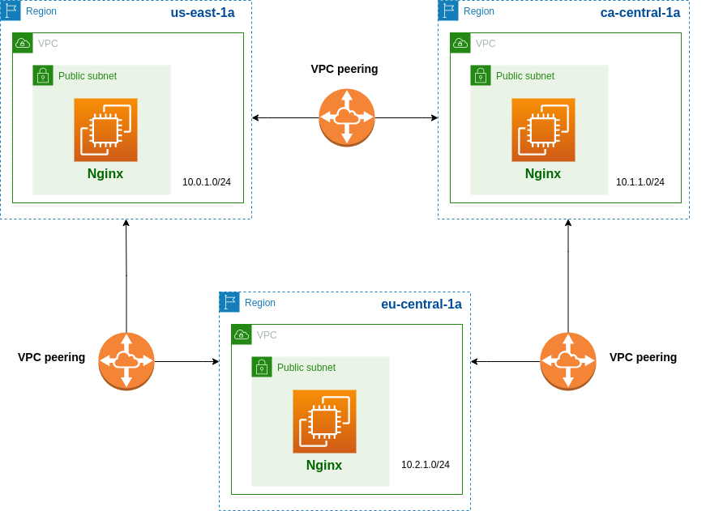

**What is VPC peering?**

A VPC peering connection is a networking connection between VPCs that enables you to route traffic between them using private IPv4 addresses or IPv6 addresses. Instances in either VPC can communicate with each other as if they are within the same network. [Link on more information.](https://docs.aws.amazon.com/vpc/latest/peering/what-is-vpc-peering.html)

**Infrastructure**

This terraform code creates three VPCs in three different Regions, brings up ec2 instances with nginx and configures VPC peering between them. 

The diagram below shows the infrastructure:



**To create infrastructure:**

1. Initialize a working directory containing Terraform configuration files

```
terraform init
```
2. Create an infrastructure
   
```
terraform apply
```

**To destroy:**

```
terraform destroy
```


